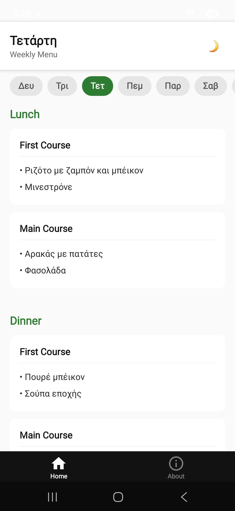

# UoWM University Restaurant Menu App

[](https://reactnative.dev/)  
[](https://www.typescriptlang.org/)  
[](./LICENSE)  

A **React Native** mobile application to view the **weekly menu** of the University of Western Macedonia (UoWM) restaurant. The app supports **dark/light mode** and **daily menu navigation**.

---

## Screenshots

  Light Mode / Dark Mode 
<div style="display:flex; gap:8px;">
  
  
</div>
## Features

- **Daily Menu**: View lunch and dinner options for any day of the week.
- **Week Navigation**: Automatically displays the correct weekly menu.
- **Dark/Light Theme**: Toggle between dark and light modes with saved preference.
- **Day Selector**: Quickly switch between days using a horizontal scrollable menu.

---

## Installation

0. **(Only available for android)**
1. Install the latest apk at the [releases tab](https://github.com/michadasis/generic-restaurant-app/releases)

## Contributing

```bash
git clone https://github.com/michadasis/generic-restaurant-app.git
cd generic-restaurant-app

