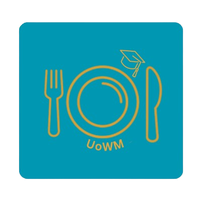
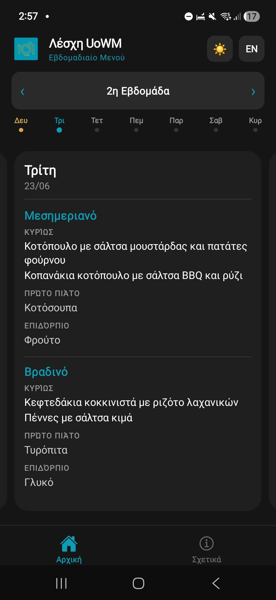
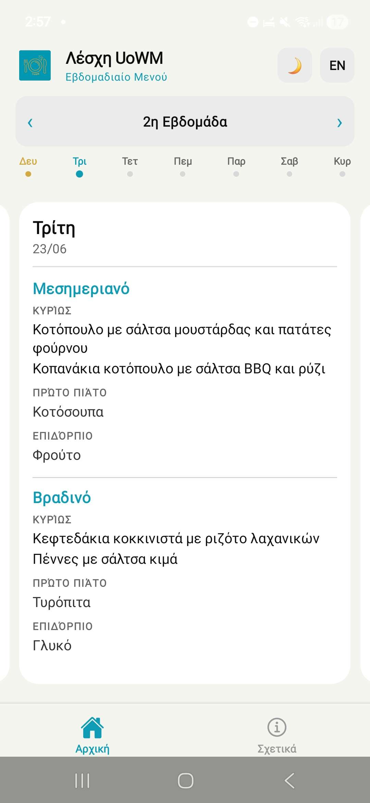

<div align="center">
  
  <h1>UoWM Restaurant Menu App</h1>
  <p>The weekly menu of the University of Western Macedonia's restaurant, right in your pocket.</p>

  <a href="https://github.com/michadasis/generic-restaurant-app/releases">
    
  </a>
  
  
  
</div>

---

## What it does

Displays the lunch and dinner menu for each day of the week. The app automatically determines which week of the 2-week cycle you're in and opens on today's menu.

## Screenshots

<div align="center">
  
  
</div>

## Installation

Download the latest `.apk` from the [releases page](https://github.com/michadasis/generic-restaurant-app/releases) and install it on your Android device.

> Android only. iOS is not supported.

## Features

- **Automatic week detection** — calculates the current cycle week based on the date
- **Swipeable cards** — swipe left/right to change day; reaching the end of the week automatically moves to the next
- **Dark / Light mode** — toggle with one tap, preference saved locally
- **Greek / English** — switch language with the press of a button
- **Auto updater** — shows a popup when a new version is available on GitHub
- **UoWM theme palette** — teal & amber color scheme inspired by the UoWM logo

## Project Structure

```
app/
  (tabs)/
    index.tsx        Main menu screen
    About.tsx        About screen
    _layout.tsx      Tab navigation
  _layout.tsx        Root layout

components/
  UpdateModal.tsx    Update notification popup

constants/
  i18n.ts            All UI strings (GR + EN)
  theme.ts           Colors & theme objects

data/
  menu.ts            TypeScript interfaces + buildMenu()
  restaurantMenu.js  Raw menu data

hooks/
  useUpdateChecker.ts  GitHub release checker

utils/
  getToday.ts        Current day key and label
  getWeek.ts         Current week in the cycle
```

## Development

> Requires [EAS CLI](https://docs.expo.dev/eas/): `npm i -g eas-cli`

```bash
git clone https://github.com/michadasis/generic-restaurant-app.git
cd generic-restaurant-app
npm i
npm run start
```

**Build for testing (.apk):**

```bash
eas build --platform android --profile preview
```

**Build for production:**

```bash
eas build --platform android --profile production
```

## Credits

Developed by [**Ioannis Michadasis**](https://github.com/michadasis).

Logo designed by **Katerina Maki**.

## License

MIT — see [LICENSE](./LICENSE) for details.