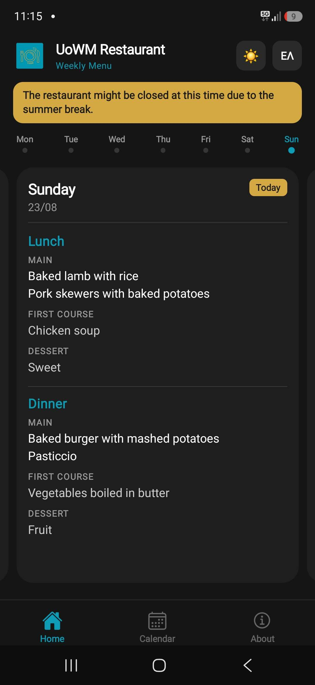
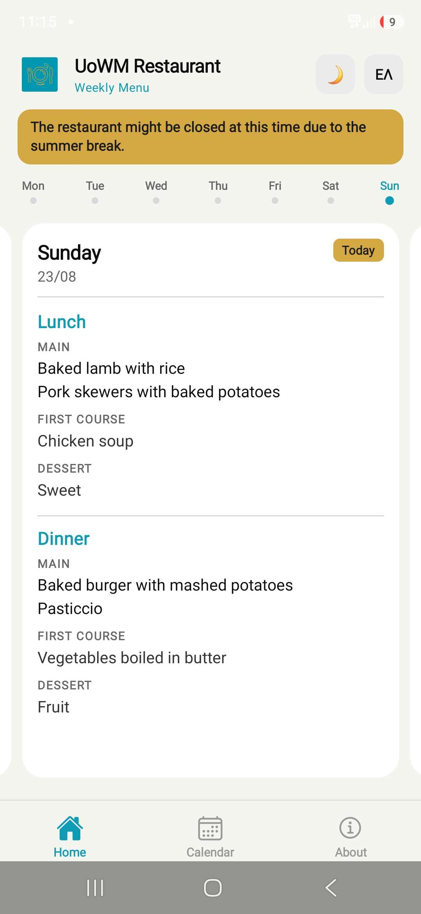
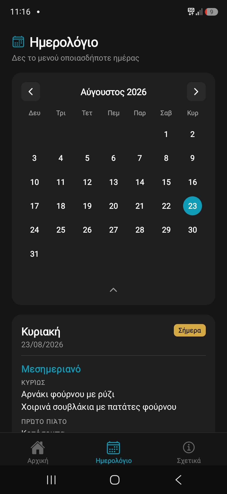
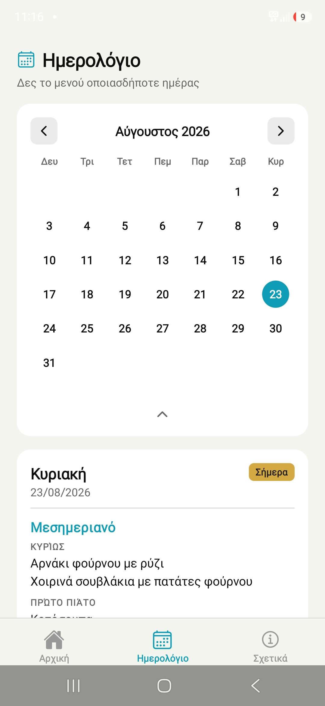

<div align="center">
  
  <h1>UoWM Restaurant Menu App</h1>
  <p>The weekly menu of the University of Western Macedonia's restaurant, right in your pocket.</p>
</div>

## Why this exists

The restaurant menu used to live on a printed sheet near the entrance, or buried somewhere on the university site. This app just puts it on your phone. Open it and you immediately see what's being served today, for both lunch and dinner.

## What it does

The menu cycle is variable from the university, however the app figures out on its own which week you're currently in, so you never have to think about it. It opens straight to today's menu. From there you can swipe left or right to move through the rest of the week, and if you keep swiping past the last day it just rolls into the next week for you.

## Screenshots

<div align="center">
  
  
  
  
</div>

## Installation

Grab the latest APK from the releases page and install it on your Android phone.

https://github.com/michadasis/generic-restaurant-app/releases

It's Android only for now. There's no iOS build.

## Features

* Figures out the current week in the cycle on its own, based on today's date
* Swipe through the days, with the week rolling over automatically at the edges
* A calendar screen to jump straight to any day, not just the current week
* Android home screen widgets (compact and full) showing today's menu, updating on their own throughout the day
* Dark mode and light mode, switchable with one tap, remembered for next time
* Greek and English, switchable the same way
* Checks GitHub on launch and lets you know if a newer version is out
* Colors pulled from the actual UoWM logo, teal and amber
* Gives you a heads up if the restaurant's probably closed, around the summer break and right when a new academic year is about to start
* Menu comes from a Supabase database, cached on device so it still shows the last known menu offline

## How the code is laid out

```
app/
  (tabs)/
    index.tsx       the main menu screen, this is where most of the logic lives
    Calendar.tsx     jump to any day, not just the current week
    About.tsx        the about screen
    _layout.tsx      tab navigation
  _layout.tsx        root layout

components/
  MealSection.tsx    renders a single meal (lunch/dinner) block on the menu screen
  MenuSkeleton.tsx   loading placeholder that mirrors the real menu card
  UpdateModal.tsx    the popup that shows up when a new version is available

constants/
  i18n.ts            every bit of text in the app, Greek and English
  theme.ts           the color palette and the dark and light theme objects

data/
  menu.ts            types, the raw-to-display transform, and the useMenu hook screens read from
  menuService.ts     fetches/caches the menu from Supabase (network-first, AsyncStorage fallback)

hooks/
  useUpdateChecker.ts  checks the GitHub releases API for a newer version

utils/
  getToday.ts          works out today's day and its label
  getWeek.ts           works out which week of the cycle we're in
  getClosureNotice.ts  works out if the restaurant's likely closed for the summer break or not open yet for the new one

widget/
  TodayMenuCompactWidget.tsx  small home screen widget, today's current meal only
  TodayMenuFullWidget.tsx     bigger widget, both lunch and dinner at a glance
  widget-task-handler.ts      builds the widget's data and re-renders it on schedule
```

## Running it yourself

You'll need the EAS CLI installed globally first.

```bash
npm i -g eas-cli
```

Then clone the repo, set up your environment, and start it up.

```bash
git clone https://github.com/michadasis/generic-restaurant-app.git
cd generic-restaurant-app
npm i
cp .env.example .env
```

Fill in `EXPO_PUBLIC_SUPABASE_URL` and `EXPO_PUBLIC_SUPABASE_ANON_KEY` in `.env` from your Supabase project's API settings, then:

```bash
npm run start
```

The home screen widgets rely on native code (`react-native-android-widget`), so they won't render inside plain Expo Go, you'll need a [dev client](https://docs.expo.dev/develop/development-builds/introduction/) build (`eas build --profile development`) to see them.

To build an APK for testing:

```bash
eas build --platform android --profile preview
```

To build the production version:

```bash
eas build --platform android --profile production
```

## Updating the menu

The menu lives in a Supabase Postgres database (`menu_meta`, `breakfast_items`, `menu_items` — schema in `restaurantMenu.sql` which is generated by [this repo](https://github.com/michadasis/uowm-pdf-menu-to-js/tree/restaurant-mobile-app)). Updating it for a new cycle means editing those rows directly or updating with a new .sql file generated by the repository mentioned before (e.g. via the Supabase SQL editor); the app and widget picks it up the change automatically the next time they refresh, no rebuild needed.

The app talks to Supabase over its public REST API using only the anon key (`EXPO_PUBLIC_SUPABASE_ANON_KEY` in `.env`, which is gitignored, copy `.env.example`), which Row Level Security restricts to read only. The service_role key, JWT secret, and raw Postgres connection string must never be added to `.env` or committed, because they grant full write/admin access to the database.

## Credits

Built by [Ioannis Michadasis](https://github.com/michadasis/).

Logo by Katerina Maki.
